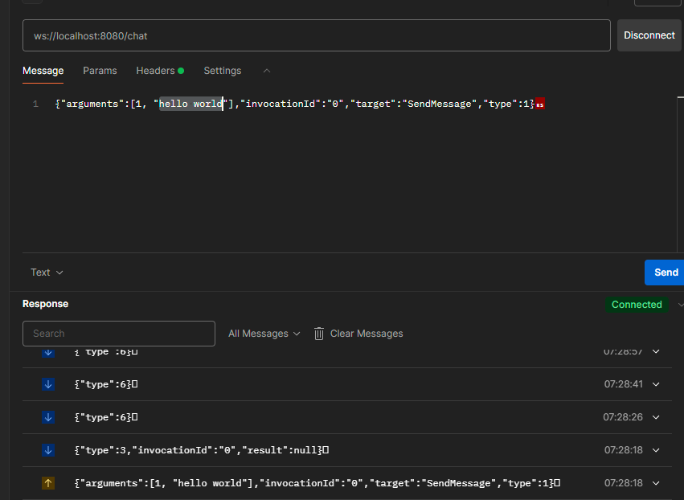
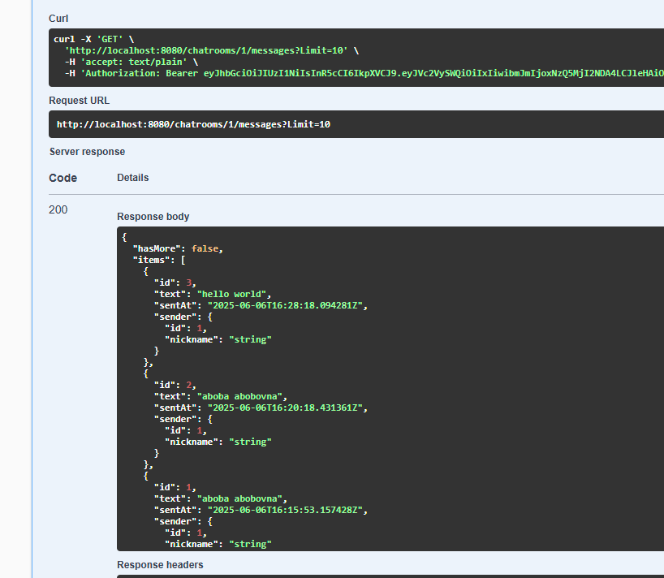

# Тестовое задание для Территрии 2.0, чат на базе SignalR

## Запуск приложения
```bash
git clone https://github.com/artemilin-2023/chat-signalr-testovoe.git && cd chat-signalr-testovoe && docker compose up --build
```

Swagger: http://localhost:8080/swagger/index.html

## Описание

Старался придерживаться чистой архетектруы, не стал слишком усложнять домен (сделал простые Анемичная модели). Не стал писать валидаторы и тесты что бы не тратить много времени на тестовое, не создавал frontend по той же причине.

Структура проекта
- `Chat.API` - слой доступа к приложению, содержит контроллеры и хаб.
- `Chat.Application` - слой бизнес логики, содержит сервисы для выполнения бизнес-кейсов
- `Chat.Common` - хранит общие вспомогательные классы/константы
- `Chat.Contracts` - слой с контрактами между нашим api и внешним миром. Содержит request/response записи и кастомные исключения
- `Chat.Domain` - слой с доменными моделями
- `Chat.Infrastructure` - инфраструктурный слой, скрывающий тонкости работы с бд, редисом, аутентификацией 

Реализовал 
- Регистрация пользователя
- Аутентификация пользователя (JWT, кейклок не стал подключать, сделал самописную)
- Создание чата
- Получение списка чатов (всех/текущего пользователя, с пагинацией)
- Получение истории сообщений чата (с обратной пагинацией)
- Отправка сообщения в чат
- Подключение/отключение к чату
- Глобальная обработка ошибок (для signalr и http)

использовал:
- .NET 9
- ASP.NET Core Web API
- SignalR
- Entity Framework Core
- PostgreSQL
- Redis (для хранения refresh токенов)
- Serilog
- JWT Authentication
- Docker + compose

## Конфигурация
Все окружение уже готово к запуску, параметры инфраструктуры находятся в файле `docker-compose.yaml`, параметры приложения находятся в `appsettings.json`.
Через `appsettings.json` можно задать настройки JWT и логгирования Serilog.

## Скрины отправки сообщения

отправка через ws сообщения (через постмен), рассылается всем клиентам в чате
0. Устанваливаем передачу данных между клиентом и SignalR хабом как json
```
{"protocol":"json","version":1}
```

1. JoinChat - присоединиться к чату
```
{"arguments":[1],"invocationId":"0","target":"JoinChat","type":1}
```

1. SendMessage "hello world" в чат с id 1
```
{"arguments":[1, "hello world"],"invocationId":"0","target":"SendMessage","type":1}
```



получение всех сообщений этого чата через GET запрос

